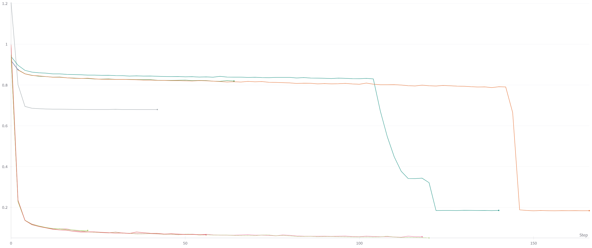
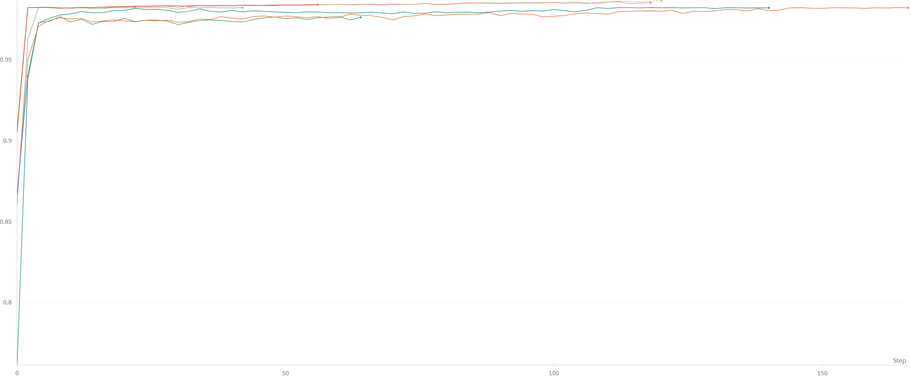
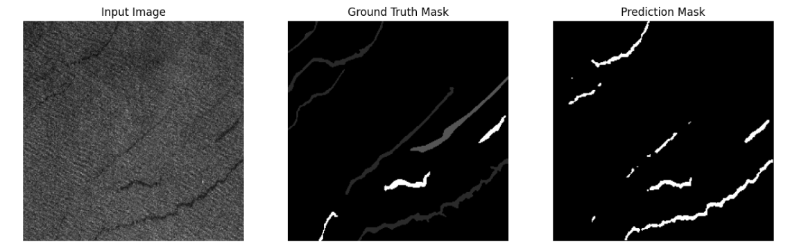
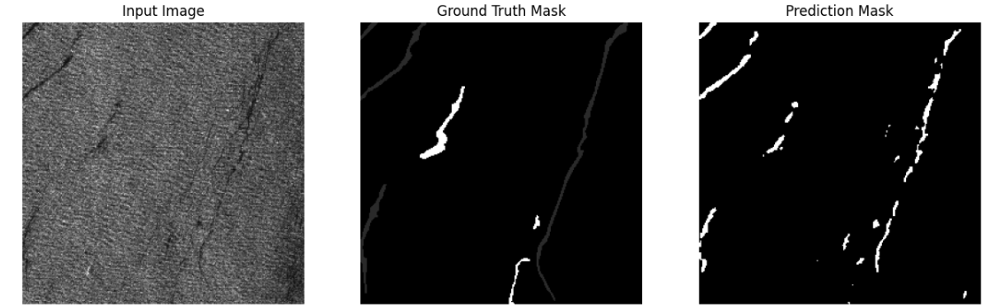
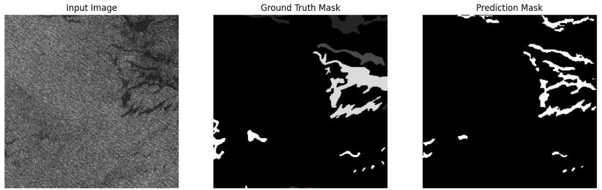
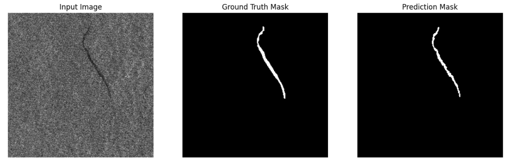
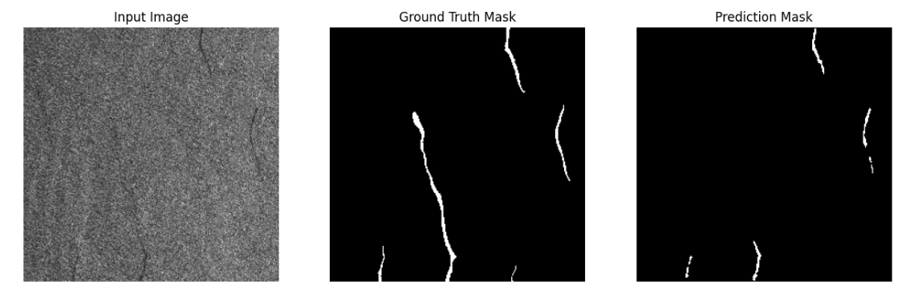
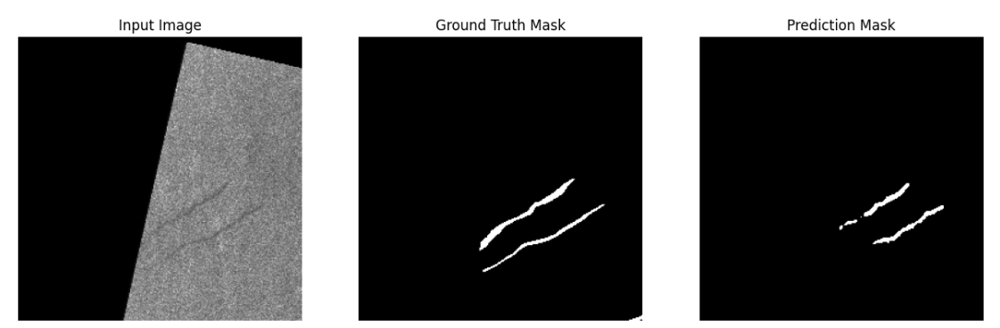

# Oil-Seep-Detection: Segmenting and Detecting Oil Seeps from Synthetic Aperture Radar Images

## Task Description

This project focuses on developing a U-Net-based deep learning model to segment and detect oil seeps from Synthetic Aperture Radar (SAR) imagery. The model is trained to identify oil slicks on ocean surfaces, which are common indicators of natural petroleum seeps.

We evaluated different advanced loss functions such as **Dice Loss**, **IoU Loss**, **Focal Loss**, and **Tversky Loss** to improve the segmentation quality and address class imbalance issues. The project tracks real-time training and evaluation using **Weights & Biases (WandB)**, where various metrics such as **Dice Coefficient**, **IoU**, **Precision**, **Recall**, **F1 Score**, and **Accuracy** are logged.

## Project Structure

```
Oil_Seep_Detection/
│
├── data/                       # Directory for datasets (images and masks)
│   ├── small_train_images_256/  # Directory for training images
│   ├── small_train_masks_256/   # Directory for training masks
│   ├── valid_images_256/        # Directory for validation images
│   ├── valid_masks_256/         # Directory for validation masks
│   ├── eval_images_256/         # Directory for evaluation images
│   ├── eval_masks_256/          # Directory for evaluation masks
│
├── main.py                      # Main training and evaluation script
├── model.py                     # U-Net model definition
├── loss_function.py             # Various loss function implementations
├── util.py                      # Utility functions (e.g., Early Stopping, prediction saving, plotting)
├── dataloader.py                # Data loading and preprocessing scripts
├── Train.ipynb.py               # Quick train and inferencing(include the result)                     
├── trained_model/               # Directory for saving trained models
├── output/                      # Directory for saving predictions and results during evaluation
├── logs/                        # Training and evaluation logs
└── README.md                    # Project README file
```

## Dataset

The dataset used for training, validation, and evaluation consists of satellite SAR imagery, with manually annotated masks representing oil seeps.

There are two tasks you can perform with this dataset:

1. **Segmentation**: Focus on distinguishing seeps (1) from non-seeps (0).
2. **Classification**: Classify the type of seep (e.g., oil, natural seep).

## UNet Architecture

The **U-Net** architecture contains two paths:

1. **Encoder**: The encoder captures the context of the image and extracts features using convolutional layers with down-sampling.
2. **Decoder**: The decoder precisely locates the seeps by using transposed convolutions for upsampling, followed by concatenation with encoder feature maps for precise segmentation.

### Advantages of U-Net

- Works well with small datasets due to the robustness provided by data augmentation.
- Efficient and scalable for multi-class problems.
- The network does not contain fully connected layers, making it size-agnostic.

### Disadvantages of U-Net

- Requires tuning the architecture size to match the features of the input images.
- The high number of layers can lead to longer training times.

### Model Architecture Summary

The final model has approximately **1,177,649** trainable parameters, and the input image size is **256x256x1** (SAR images are grayscale).

---

## Loss Functions

Due to the class imbalance in the dataset (many more non-seep pixels than seep pixels), we experimented with several loss functions. Each loss function has unique strengths in handling this imbalance.

### Loss Functions Overview:

| **Loss Function**         | **Accuracy** | **Loss** | **Comments** |
|---------------------------|--------------|----------|--------------|
| Cross Entropy (CE)         | 98.64        | 0.0529   | Standard for classification tasks but struggles with high class imbalance, as it treats all classes equally. |
| Dice Loss                 | 98.34        | 0.1879   | More sensitive to small seep regions, balancing false positives and false negatives by measuring overlap between prediction and ground truth. |
| IoU Loss                  | 98.19        | 0.1853   | Focuses on the intersection-over-union, which is useful for imbalanced datasets, penalizing misclassified pixels, especially at boundaries. |
| Tversky Loss              | 98.20        | 0.6815   | Handles imbalanced data by giving more control over penalizing false positives and false negatives with adjustable parameters. Useful for challenging cases. |

---

## Loss Function Formulae

1. **Cross Entropy (CE)**:

   The Cross Entropy loss is the standard loss function for classification tasks. It works by comparing the predicted probability distribution with the ground truth.

   $$ 
   \text{CE}(p, \hat{p}) = - \left[ p \cdot \log(\hat{p}) + (1 - p) \cdot \log(1 - \hat{p}) \right]
   $$

   - **Comments**: Works well for balanced datasets but may lead to biased predictions in cases of class imbalance.

2. **Dice Loss**:

   The Dice Loss measures the overlap between the predicted segmentation and the ground truth, similar to the F1 score. It's more effective for tasks with imbalanced classes.

   $$ 
   \text{Dice Loss} = 1 - \frac{2 \cdot |P \cap G|}{|P| + |G|}
   $$

   where \( P \) is the predicted segmentation, and \( G \) is the ground truth.

   - **Comments**: Dice loss gives more weight to smaller, harder-to-predict regions like oil seeps, making it a better choice for imbalanced data.

3. **IoU (Intersection over Union) Loss**:

   IoU loss is used for segmentation tasks and measures the overlap between the predicted segmentation and the ground truth. It penalizes the model based on the area of overlap.

   $$ 
   \text{IoU Loss} = 1 - \frac{|P \cap G|}{|P \cup G|}
   $$

   - **Comments**: IoU Loss is particularly effective at penalizing regions where there is a mismatch between the prediction and the ground truth, especially in boundary regions.

4. **Tversky Loss**:

   The Tversky Loss is a generalization of the Dice Loss that allows for more flexible handling of false positives and false negatives by adjusting the balance between them. It is particularly useful for highly imbalanced datasets.

   $$ 
   \text{Tversky Index (TI)} = \frac{|P \cap G|}{|P \cap G| + \alpha \cdot |P \setminus G| + \beta \cdot |G \setminus P|}
   $$

   $$ 
   \text{Tversky Loss} = 1 - \text{TI}
   $$

   - **Comments**: Adjusting the parameters \( \alpha \) and \( \beta \) allows us to control the relative importance of false positives and false negatives. This flexibility makes it particularly useful for imbalanced datasets where one type of error (e.g., false negatives) is more critical than the other.


## Metrics Used

To evaluate the performance of the model, we used several key metrics designed for segmentation tasks. These metrics provide insights into the accuracy and robustness of the model, especially when dealing with class imbalance, such as the small number of seep pixels compared to the non-seep pixels.

### 1. **Dice Coefficient**
The Dice Coefficient measures the overlap between the predicted mask and the ground truth mask. It is useful in binary and multi-class segmentation tasks and is particularly effective in handling imbalanced data.

**Formula**:
$$
\text{Dice Coefficient} = \frac{2 \cdot |P \cap G|}{|P| + |G|}
$$
Where \(P\) is the predicted segmentation and \(G\) is the ground truth.

- **Purpose**: To measure the similarity between predicted masks and ground truth masks.

### 2. **Intersection over Union (IoU)**
IoU, also known as the Jaccard index, is a common evaluation metric for segmentation. It calculates the area of overlap between the predicted mask and the ground truth mask, divided by the area of their union.

**Formula**:
$$
\text{IoU} = \frac{|P \cap G|}{|P \cup G|}
$$

- **Purpose**: IoU is used to penalize misclassified regions and is effective for measuring segmentation accuracy, especially in boundary regions.

### 3. **Precision**
Precision measures the proportion of true positive predictions (correctly identified seep pixels) out of all positive predictions made by the model.

**Formula**:
$$
\text{Precision} = \frac{\text{True Positives}}{\text{True Positives} + \text{False Positives}}
$$

- **Purpose**: Precision tells us how many of the pixels labeled as seep are actually seeps, which helps assess the model's ability to avoid false positives.

### 4. **Recall**
Recall measures the proportion of true positive predictions out of all actual positive cases in the dataset.

**Formula**:
$$
\text{Recall} = \frac{\text{True Positives}}{\text{True Positives} + \text{False Negatives}}
$$

- **Purpose**: Recall tells us how many actual seep pixels were correctly identified by the model, helping assess its ability to avoid false negatives.

### 5. **F1 Score**
The F1 score is the harmonic mean of Precision and Recall, providing a single metric that balances both.

**Formula**:
$$
\text{F1 Score} = 2 \cdot \frac{\text{Precision} \cdot \text{Recall}}{\text{Precision} + \text{Recall}}
$$

- **Purpose**: The F1 score is particularly useful when dealing with class imbalance, as it balances the trade-off between Precision and Recall.

### 6. **Accuracy**
Accuracy measures the proportion of correctly classified pixels (both seeps and non-seeps) out of all pixels in the image.

**Formula**:
$$
\text{Accuracy} = \frac{\text{True Positives} + \text{True Negatives}}{\text{Total Number of Pixels}}
$$

- **Purpose**: While accuracy is useful, it can be misleading in cases of class imbalance. It’s best used in combination with the other metrics.


## Training

### Hyperparameters:

- **Batch Size**: 16
- **Epochs**: 300
- **Learning Rate**: 0.001
- **Optimizer**: Adam
- **Loss Functions**: Various (BCE, Dice Loss, IoU Loss, Focal Loss, Tversky Loss)
- **Early Stopping**: Applied with a patience of 10 epochs and a minimum delta of 0.001.
- **ReduceLROnPlateau**: Reduce the learning rate by a factor of 0.1 if the validation loss does not improve for 5 continuous epochs.

We use the Adam optimizer, which combines the advantages of Adagrad and RMSProp to perform well on both sparse and noisy datasets.

### Training Loss Plot

_Fill this in with your training loss plot._





## Results


### Plot: Predicted vs Ground Truth Masks












## Download the pretrain model

Download the model from here [Link](https://drive.google.com/drive/folders/1CL4BLa00qEykI3OLUYmrm-I_hdUJst_z?usp=sharing).
and put the model at `trained_model` folder
if you have any problem, plz contact me
- **Email**: Arthur12137@gmail.com
## Install Environment

To set up the environment and install dependencies, follow the instructions below:

1. Clone the repository:
    ```bash
    git clone https://github.com/your-repo/oil_seep_detection.git
    cd oil_seep_detection
    ```

2. Install the required dependencies:
    ```bash
    conda create --name oil_seep_env python=3.8
    conda activate oil_seep_env
    pip install -r requirements.txt
    ```

3. Install **WandB** for tracking:
    ```bash
    pip install wandb
    ```

4. Initialize **WandB**:
    ```bash
    wandb login
    ```

## Train the Model

To train the model with your custom settings, run:

```bash
python train.py --train_images_dir data/small_train_images_256/ \
                --train_masks_dir data/small_train_masks_256/ \
                --valid_images_dir data/valid_images_256/ \
                --valid_masks_dir data/valid_masks_256/ \
                --epochs 300 \
                --lr 0.001 \
                --patience 10 \
                --min_delta 0.001 \
                --loss_function CrossEntropyLoss \
                --mode train
```

## Quick Inference

Once trained, you can evaluate the model by running the following command:

```bash
python main.py --train_images_dir data/small_train_images_256/ \
               --train_masks_dir data/small_train_masks_256/ \
               --valid_images_dir data/valid_images_256/ \
               --valid_masks_dir data/valid_masks_256/ \
               --eval_images_dir data/eval_images_256/ \
               --eval_masks_dir data/eval_masks_256/ \
               --loss_function CrossEntropyLoss \
               --mode eval \
               --

output_dir results/
```

## Contact

For questions, suggestions, or issues, feel free to reach out:

- **Email**: Arthur12137@gmail.com
